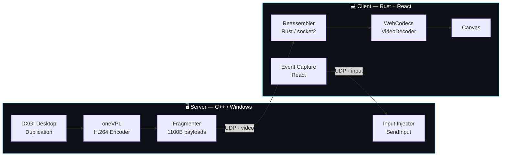

<div align="center">

# Click2Cee

A light and efficient remote desktop tool, intended for use over a private VPN.

Made with GPU accelerated screen capture and custom-made UDP protocol for both streaming and input injection.

<!-- TODO: drop a gif/screenshot here. A short clip of the client -->

[](#)
[](#)
[](#)
[](#)
[](#)

</div>

---

## Requirements

> [!NOTE]
> Only Windows is supported for servers at the moment. Linux on the way.

**To run the client:**

* **A WebCodecs-capable webview with an H.264 decoder** — this is the real requirement, more than the OS is
  * **Windows** — the WebView2 Runtime, preinstalled on Windows 11. Nothing else to do
  * **Linux** — Tauri uses WebKitGTK, which decodes through GStreamer. The H.264 elements ship separately and most desktop installs omit them:

    ```bash
    sudo pacman -S gst-libav gst-plugins-bad
    ```

    Verify with `gst-inspect-1.0 avdec_h264`. If it reports no such element the decoder is missing, `VideoDecoder.configure()` fails with *no decoder found*, and the canvas stays black while packets arrive normally.

    > `openh264` will **not** do — it is Baseline only, and the stream is High profile. It needs `avdec_h264` or a VA-API element.
* **GPU driver with H.264 decode** — software decode will not hold 1080p60

**To run the server:**

* **Windows 10 1803 or newer** — DXGI Desktop Duplication and the D3D11 feature set it needs
* **Intel Graphics Driver**, on a Quick Sync capable GPU
* **Intel oneVPL Runtime** — the encoder is created with `MFX_IMPL_TYPE_HARDWARE` and `MFX_ACCEL_MODE_VIA_D3D11`, so there is no software fallback path
* An **interactive desktop session** — Desktop Duplication and `SendInput` both require one, so it cannot run as a session-0 service
* **Administrator privileges** for full input control — UIPI silently blocks `SendInput` against higher-integrity windows, so without elevation clicks do nothing over UAC prompts, Task Manager, or any elevated app

**To build:**

* **GCC (MinGW-w64)** with C++20 — the server. Brings its own Win32, Direct3D 11, DXGI and Winsock2 headers
* **Intel oneVPL SDK**, headers and libs — the server encoder
* **Rust** stable, 2021 edition — the client backend
* **Bun** — the client frontend
* **Tauri CLI 2.x** — comes in with `bun install`

**Network:**

* Firewall rules allowing inbound UDP on `INPUT_PORT` (server, default `5001`) and `PLAYER_PORT` (client, default `5002`)
* Roughly **15 Mbit/s sustained** for video at the default bitrate, plus headroom
* A path MTU of at least **1408 bytes** so fragments are not split again in transit
* **Low packet loss.** A single lost fragment discards its entire frame, and the loss compounds until the next IDR — this is why the tool is intended for a LAN or a private VPN rather than the open internet

> [!WARNING]
> There is no authentication or encryption on either channel. Anything that can reach `INPUT_PORT` can drive the host's keyboard and mouse. Run it on a trusted network or a private VPN, never on a public interface.

---

## Highlights

| | |
|---|---|
| **Zero-copy capture** | DXGI Desktop Duplication hands a D3D11 texture straight to the encoder on the same device. No readback to system RAM, no colour conversion pass. |
| **Hardware H.264** | Intel oneVPL encodes on-GPU with the latency knobs opened up: no B-frames, `AsyncDepth 1`, HRD conformance off, `LowDelayBRC` on. |
| **Hand-rolled UDP protocol** | Custom 8-byte fragment header, MTU-sized datagrams, in-order-or-drop reassembly. No RTP, no WebRTC, no dependency doing the work. |
| **Plugin-free decode** | WebCodecs `VideoDecoder` consumes raw Annex-B and paints to a canvas. Codec parameters are parsed out of the SPS at runtime. |
| **Full input reconstruction** | Browser `KeyboardEvent.code` names travel as strings; the server diffs them against held state and synthesises `SendInput` events — so held keys, drags and chorded modifiers survive the round trip. |
| **Resolution independent** | Pointer coordinates are normalised to `0..65535` on the wire, matching `MOUSEEVENTF_ABSOLUTE` exactly. The client never learns the host's resolution. |

---

## Architecture
> by Big Laude



**Two independent threads on the server**, because both loops block on different things — the encoder waits on the compositor, the input socket waits on the wire. Neither can wait for the other.

---

## The pipeline, end to end

### Video: host screen → canvas

```
Compositor present
  └─ AcquireNextFrame          waits on the GPU, wakes the instant the desktop draws
     └─ D3D11 texture          stays in VRAM, never round-trips through system memory
        └─ oneVPL encode       BGRA in, Annex-B H.264 out, IDR every GOP
           └─ Fragment         seq/index/count header + 1100B, MTU-safe
              └─ UDP  ─────────────────────►
                                              └─ Reassemble    in-order or drop the frame
                                                 └─ VideoDecoder   codec parsed from SPS
                                                    └─ drawImage   canvas, GPU frame closed immediately
```

### Input: browser event → host

```
React event
  └─ e.buttons / e.code        held state, not edge state
     └─ normalise 0..65535     resolution independent
        └─ Tauri IPC
           └─ UDP  ──────────►
                                 └─ Parse       length-prefixed key names
                                    └─ convert()   code names → virtual-keys
                                       └─ diff vs held    down/up only on change
                                          └─ SendInput     one batched call
```

---

## Wire protocol
> by Big Laude

Both directions are hand-specified. Nothing is negotiated at runtime.

### Video fragment — server → client

Big-endian, 8-byte header, payload up to 1100 bytes.

| Offset | Size | Field | Meaning |
|---:|---:|---|---|
| `0` | 4 | `seq` | frame counter |
| `4` | 2 | `index` | fragment position within the frame |
| `6` | 2 | `count` | total fragments in this frame |
| `8` | ≤1100 | `payload` | raw Annex-B slice |

A missing or reordered fragment discards the whole frame — a partial frame is worse than none, and the next IDR repairs the stream.

### Input packet — client → server

One datagram is one complete snapshot of input state. Nothing is a delta, so a lost packet costs nothing the next one doesn't repair.

| Offset | Size | Field | Meaning |
|---:|---:|---|---|
| `0` | 1 | `count` | number of keys held |
| `1` | 1 | `btn` | mouse button code (below) |
| `2` | 2 | `x` | normalised `0..65535` |
| `4` | 2 | `y` | normalised `0..65535` |
| `6` | … | `keys` | `count` × (length byte + ASCII `KeyboardEvent.code`) |

**Button codes**

| Code | Meaning | | Code | Meaning |
|---:|---|---|---:|---|
| `0` | nothing held | | `4` | X1 (back) |
| `1` | left | | `5` | X2 (forward) |
| `2` | right | | `100` | wheel up |
| `3` | middle | | `101` | wheel down |

Buttons are **edge-triggered on change**: the server releases whatever it held and presses the new code only when `btn` differs from last packet. Repeating the same code is what lets a drag hold while the pointer keeps moving. Wheel codes never latch — they fire a notch and are done.

---

## Tech stack

#### server: C++

- **DXGI Desktop Duplication** — screen capture
- **Direct3D 11** — shared device, GPU-resident frames
- **Intel oneVPL** — hardware H.264
- **Winsock2** — raw UDP, `recvfrom` + source filtering
- **SendInput / Win32** — keyboard and mouse injection
- **std::thread / std::atomic** — portable concurrency

#### client: Rust + TypeScript

- **Tauri 2** — native shell, raw-byte IPC
- **socket2** — sized receive buffers
- **React 19 + TypeScript** — event capture, UI
- **WebCodecs** — hardware-accelerated decode
- **Canvas 2D** — presentation

---

## Getting started

See [Requirements](#requirements) for what needs to be installed.

### Configure

Both halves read a shared `.env` from the repo root.

example on same machine:
```ini
SERVER_HOST=127.0.0.1   # server host address
CLIENT_HOST=127.0.0.1   # client host address
VIDEO_PORT=5000         # server port for streaming video
INPUT_PORT=5001         # server port for receiving inputs
PLAYER_PORT=5002        # client port for receiving video
```

### Build & run

```bash
# Server
cd server
.\run_server.bat

# Client
cd client
bun install
bun run tauri dev
```

<!--## Roadmap

- [ ] Linux server — X11/Wayland capture, VA-API encode, `uinput` injection
- [ ] Multi-monitor capture and selection
- [ ] Forward error correction on video fragments
- [ ] Sequence numbers on input packets
- [ ] Audio
- [ ] Clipboard sync-->
